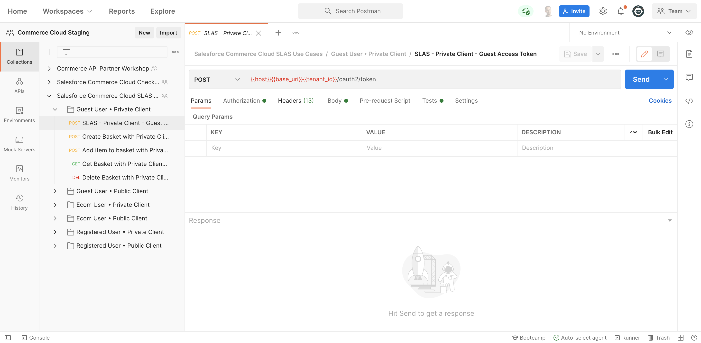

# Salesforce Commerce Cloud APIs for Postman

A [Postman](https://www.postman.com) collection of 230+ requests for the following Salesforce APIs:

<table>
   <tr>
      <td>
         <ul>
            <li>Shopper Login and API Access Service (SLAS)</li>
         </ul>
      </td>
      <td>
         <ul>
         </ul>
      </td>
   </tr>
</table>

**⚠️ Disclaimers:**
- This collection is provided as-is. It's not officially supported by Salesforce or covered by SLAs.
- API documentation is not provided with the collection. Please refer to the [official documentation](https://developer.salesforce.com/docs).

## Issues and Questions

Report issues and ask questions [here](https://github.com/forcedotcom/postman-salesforce-apis/issues).

## Installation

You can use the **Postman desktop app** or the **Postman web UI** to connect to Salesforce with the Salesforce APIs collection:

- [Install using the Postman desktop app](install-with-app.md) (recommended)
- [Install using the Postman web UI](install-with-web.md) (longer setup, requires CORS configuration in Salesforce org)

Regardless of whether you choose the desktop app or the web UI, you can use all of the collection’s requests and your changes are synchronized between the two environments so you can easily switch between them at any time.

## Additional Documentation

- [Keeping the collection up to date](updating.md)
- [Working with environments to connect to multiple orgs](working-with-environments.md)
- [Contributing](contributing.md)
