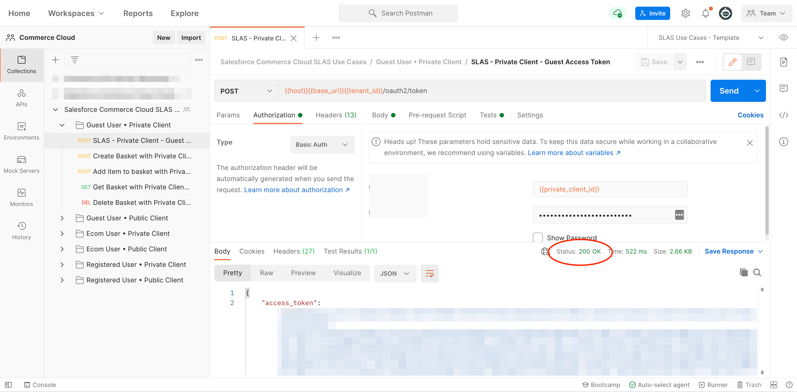

[Back to main page](README.md)

# Installing with the Postman Web UI

Consider this installation option if you can’t install the Postman desktop app.


- [Fork the Collection](#fork-the-collection)
- [Configure the Collection](#configure-the-collection)
- [Authentication](#authentication)
- [Execute](#execute)


## Fork the Collection

1. Using a browser, [sign up/in to Postman](https://identity.getpostman.com/login).
2. Navigate to [this link](https://www.postman.com/salesforce-developers/workspace/salesforce-developers/collection/[put new ID in here]/fork) to create a fork of the collection.
3. Enter a label for your fork (e.g.: “My fork”).
4. Select a workspace (the default “My Workspace” workspace is fine).
5. Click **Fork Collection**.


## Configure the Collection

1. Click **Salesforce Commerce Cloud SLAS Use Cases**
1. Open the **Variables** tab.
1. Update the CURRENT VALUE with your values for public and private code verifiers and challenges.
1. Click **Save**.

Additionally it is useful to create an environment with the following variables in before running any test.

```
host - The host to the SLAS service. Should include https://
tenant_id - The tenand id that was created when SLAS and ECOM was set up.
base_uri - The base URI to SLAS. ex. /api/v1/organizations/
ocapi_uri - The uri to ECOM to access the OCAPI APIs. Should include https://
ocapi_site - The ECOM Site used in OCAPI calls. Ex. SiteGenesis or RefArch
ecom_customer_id - A customer (shopper) user from ECOM
ecom_customer_pw - A customer (shopper) user password from ECOM
private_client_id - The private client when client was created in SLAS.
private_client_secret - The private client secret when client was created in SLAS.
public_client_id - The public client when client was created in SLAS.
redirect_url - One of the redirect_uris that are part of the SLAS client.
```

## Authentication
For SLAS Authentication happens with the above mentioned public and private code verifiers and challenges.


## Execution
1. Expand the collection and select the `Guest User * Private Client > SLAS - Private Client - Guest Access Token` request.
1. Click `Send`.

At this point, if your environment is correctly set up, you should see a `200 OK` status. This means that you have successfully authenticated with Salesforce and that you can now use the other collection’s requests.




[Back to main page](README.md)
